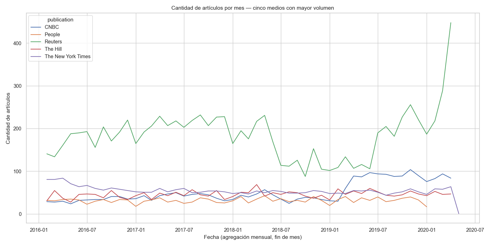
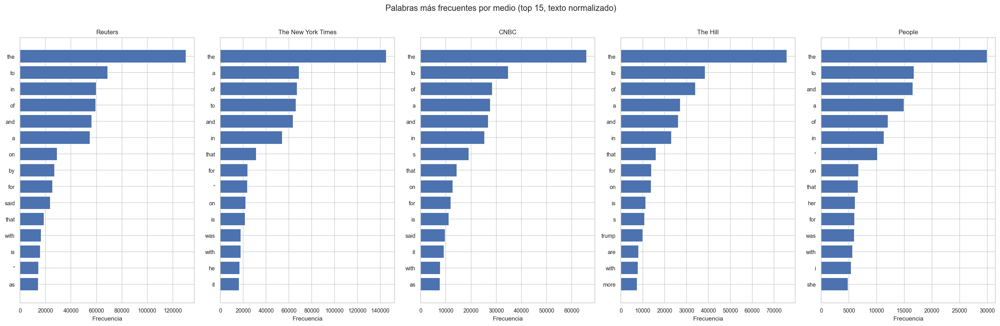
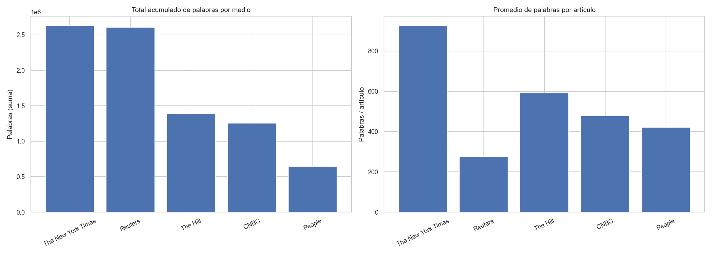
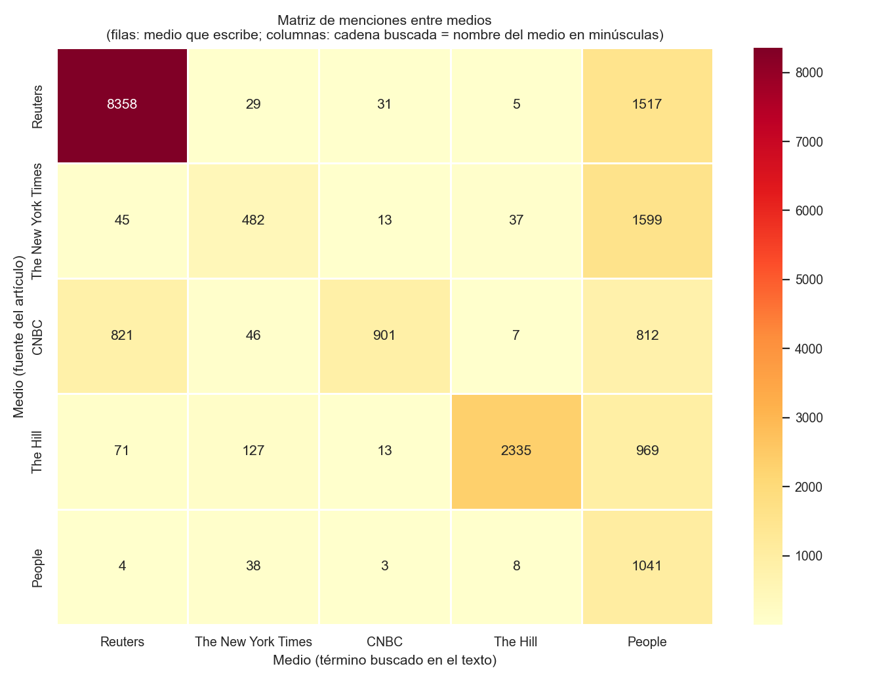
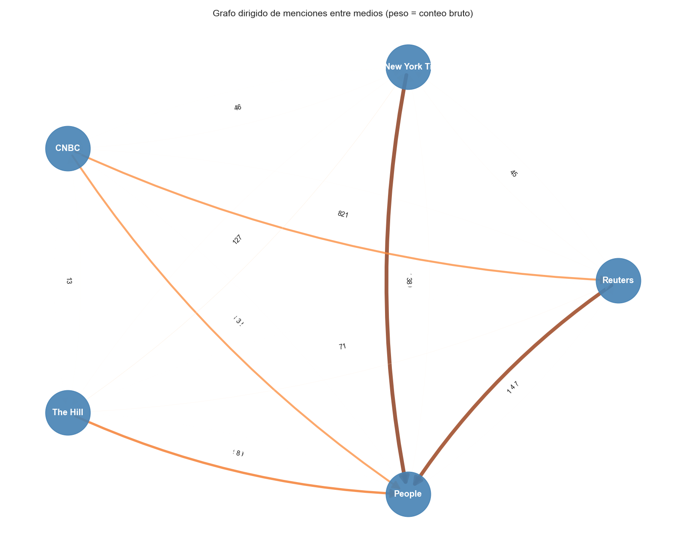

# Portada e identificación del trabajo {.unlisted}

| Campo | Completar en la versión final |
| --- | --- |
| **Universidad / Facultad** | Universidad de la República - Facultad de Ingeniería |
| **Carrera / Curso** | Introducción a la Ciencia de Datos (año 2026) |
| **Actividad / Tarea** | Tarea 1 |
| **Título del informe** | Análisis exploratorio de datos de noticias publicadas en distintos medios de prensa (All the News 2.1) |
| **Fecha de entrega** | 13 de mayo de 2026 |

# Integrantes {.unlisted}

Complete la siguiente tabla con los datos solicitados por la cátedra (ajuste la cantidad de filas si el trabajo es individual o grupal).

| Nombre y apellido | Número de estudiante | Correo institucional (opcional) |
| --- | --- | --- |
| Gustavo Tomsic | C.I. |  |
| Sebastián Díaz | 4.942.056-6 |  |

*Al exportar a PDF con Pandoc + LaTeX, las dos secciones anteriores no se numeran en el índice (`{.unlisted}`). A continuación se inserta el índice automático y comienza el cuerpo del informe.*

```{=latex}
\newpage
\tableofcontents
\newpage
```

> **Nota (exportación a Word):** el bloque anterior solo aplica a salida LaTeX/PDF. En Microsoft Word conviene generar el índice con *Referencias → Tabla de contenido* a partir de los estilos de título del documento convertido.

# Introducción

El curso de *Introducción a la Ciencia de Datos* (edición 2026) plantea una primera aproximación práctica al tratamiento de datos textuales procedentes de artículos de prensa en lengua inglesa. El objetivo general de la tarea es explorar la calidad del conjunto, delimitar un subconjunto de trabajo consistente con la letra (cinco medios de mayor frecuencia), normalizar texto para análisis léxicos elementales y construir visualizaciones que permitan comparar medios en el tiempo y en el espacio de frecuencias de palabras.

Los insumos provienen del repositorio de código base `intro-cd`. El desarrollo analítico principal se registró en el Jupyter Notebook **`Tarea_1/2026_template_tarea1.ipynb`**, donde se documentan las celdas de carga, exploración, filtrado a los cinco medios, normalización de texto, visualizaciones y matriz de menciones. Las cifras y figuras del presente informe se regeneran de forma reproducible mediante **`Tarea_1/build_informe.py`**, que replica ese flujo y exporta las imágenes a `Tarea_1/images/`.

**Alcance:** el análisis es descriptivo y exploratorio; no se incluyen modelos predictivos ni inferencia estadística formal, en coherencia con las restricciones explícitas de la letra en la sección temporal.

# Resumen ejecutivo

El presente informe documenta el trabajo exploratorio realizado sobre un subconjunto muestreado del corpus *All the News 2.1* (fuente Hugging Face: `tomas-gr/all-the-news-2-1-Component-one-sampled`), utilizando Python, Pandas, Matplotlib, Seaborn y NetworkX. Se reproduce el flujo del notebook `2026_template_tarea1.ipynb`, se reportan **resultados numéricos** obtenidos en la corrida que generó este documento, y se exportan las **figuras numeradas (Figuras 1 a 5)** a la carpeta `images/`. Las rutas de figuras son relativas a este archivo para facilitar la conversión con Pandoc (por ejemplo, a PDF o DOCX).

**Metadatos de la corrida:**

- Registros totales en el conjunto cargado: **30213**.
- Columnas: **12**; filas completamente duplicadas: **0**.
- Tras filtrar a los cinco medios principales, el subconjunto contiene **18771** filas.
- Fechas parseables en el subconjunto top-5: rango aproximado **2016-01-01** — **2020-04-01** (0 filas sin fecha válida tras `to_datetime`).

---

# Contexto de entrega (según letra de la tarea)

La letra solicita un **informe en PDF** como artefacto principal de evaluación, el **código** (notebook y, de existir, scripts auxiliares) y un **README** que indique ubicación del informe y del código. Este `informe.md` puede servir de base textual.

La conversión a PDF o Word mediante Pandoc debe ejecutarse de forma que las imágenes relativas se resuelvan correctamente. Se recomienda utilizar `--resource-path=.` apuntando al directorio donde se ubica este archivo.

Desde el directorio `Tarea_1/` (para que las rutas `images/...` resuelvan correctamente):

```bash
cd Tarea_1
pandoc informe.md -o informe.pdf --from=markdown-yaml_metadata_block+raw_tex --resource-path=. -N -V urlcolor=blue
pandoc informe.md -o informe.docx --from=markdown-yaml_metadata_block+raw_tex --resource-path=. -N
```

**Conclusión:** el repositorio debe incluir además el PDF final y las instrucciones en `README.md` según lo exija el curso.

---

# Parte 1: Cargado y limpieza de datos

## A. Exploración inicial, calidad de datos y selección de los cinco medios

Se ejecutó la carga del conjunto mediante la biblioteca `datasets` y se materializó un `pandas.DataFrame` denominado `df`. A continuación se inspeccionó la estructura con `df.info()` y se cuantificaron valores faltantes por columna.

### Resultados: estructura (`df.info`)

```text
<class 'pandas.DataFrame'>
RangeIndex: 30213 entries, 0 to 30212
Data columns (total 12 columns):
 #   Column       Non-Null Count  Dtype
---  ------       --------------  -----
 0   idx          30213 non-null  int64
 1   article_idx  30213 non-null  int64
 2   date         30213 non-null  str  
 3   year         30213 non-null  str  
 4   month        30213 non-null  str  
 5   day          30213 non-null  str  
 6   author       18808 non-null  str  
 7   title        30213 non-null  str  
 8   article      29037 non-null  str  
 9   url          30072 non-null  str  
 10  section      19981 non-null  str  
 11  publication  30072 non-null  str  
dtypes: int64(2), str(10)
memory usage: 96.1 MB
```

### Resultados: valores faltantes por columna

| columna | faltantes | porcentaje |
| --- | --- | --- |
| author | 11405 | 37.75 |
| section | 10232 | 33.87 |
| article | 1176 | 3.89 |
| url | 141 | 0.47 |
| publication | 141 | 0.47 |
| idx | 0 | 0.00 |
| article_idx | 0 | 0.00 |
| date | 0 | 0.00 |
| year | 0 | 0.00 |
| month | 0 | 0.00 |
| day | 0 | 0.00 |
| title | 0 | 0.00 |

**Interpretación breve:** los campos `author`, `article`, `url`, `section` y `publication` presentan ausencias en distinto grado; `title` aparece completo en este conjunto. Ello condiciona análisis posteriores (por ejemplo, conteos sobre el cuerpo del artículo o restricciones por sección).

### Distribución de artículos por medio (diez primeros)

| medio | articulos |
| --- | --- |
| Reuters | 9431 |
| The New York Times | 2840 |
| CNBC | 2623 |
| The Hill | 2349 |
| People | 1528 |
| CNN | 1446 |
| Refinery 29 | 1236 |
| Vice | 1154 |
| Mashable | 1045 |
| Business Insider | 660 |

### Selección operativa: cinco medios con mayor cantidad de artículos

Conforme a la letra, el resto del análisis se restringe a los **cinco medios** con mayor frecuencia en la columna `publication`.

| medio | articulos |
| --- | --- |
| Reuters | 9431 |
| The New York Times | 2840 |
| CNBC | 2623 |
| The Hill | 2349 |
| People | 1528 |

Lista ordenada utilizada en el código: `['Reuters', 'The New York Times', 'CNBC', 'The Hill', 'People']`.

### Calidad de datos en el subconjunto `df_top_5`

Tras restringir el análisis a los cinco medios seleccionados, persisten ausencias heredadas del conjunto global. La siguiente tabla resume los valores faltantes absolutos y porcentuales **dentro de `df_top_5`**.

| columna | faltantes | porcentaje |
| --- | --- | --- |
| author | 9425 | 50.21 |
| section | 2991 | 15.93 |
| article | 240 | 1.28 |
| idx | 0 | 0.00 |
| article_idx | 0 | 0.00 |
| date | 0 | 0.00 |
| year | 0 | 0.00 |
| month | 0 | 0.00 |
| day | 0 | 0.00 |
| title | 0 | 0.00 |
| url | 0 | 0.00 |
| publication | 0 | 0.00 |
| date_parsed | 0 | 0.00 |
| CleanText | 0 | 0.00 |
| word_count | 0 | 0.00 |

**Conclusión (Parte 1.A):** el conjunto presenta faltantes heterogéneos por columna y una distribución fuertemente sesgada hacia el primer medio (Reuters en esta corrida). La restricción a los cinco principales equilibra en parte el volumen, aunque subsiste desbalance relativo entre el primero y los demás. La presencia de `article` nulo en **240** filas del subconjunto implica que esas observaciones aportan cadena vacía tras `fillna` en la normalización, lo cual debe tenerse presente al interpretar frecuencias agregadas.

## B. Visualización temporal de la actividad por medio

**Procedimiento:** la columna `date` se convirtió a tipo temporal mediante `pandas.to_datetime` con el argumento `format="mixed"`, de modo que cadenas con formatos distintos puedan coexistir en la misma columna sin fallar de forma silenciosa en toda la serie. Los registros que no admiten parseo quedan como `NaT` y se excluyen del cómputo agregado. Sobre las fechas válidas se aplicó una agregación por **fin de mes** (`freq="ME"` en `pd.Grouper`), contabilizando el número de artículos por medio en cada ventana. La representación gráfica elegida es la de series temporales múltiples con codificación por color (`seaborn.lineplot`).

Conforme a la letra, no se aplican pruebas de significación ni modelado estadístico; únicamente se facilita una lectura visual de la densidad de publicación.



*Figura 1.* Cantidad de artículos por mes (agregación al fin de mes) para los cinco medios con mayor frecuencia en la columna `publication`. Equivalente a la visualización exploratoria de la **Parte 1.B** del notebook `2026_template_tarea1.ipynb` (parseo de fechas con `format='mixed'` y `seaborn.lineplot`).

**Lectura sugerida:** pueden observarse períodos de mayor densidad de publicaciones y eventuales alineamientos entre medios (picos concurrentes) frente a variaciones más aisladas en un solo medio. La escala mensual atenúa fluctuaciones diarias y facilita la lectura comparativa.

**Conclusión (Parte 1.B):** la dinámica temporal difiere entre medios; la agregación mensual es adecuada para una primera exploración, siempre documentando la pérdida de filas con fechas no parseables.

## C. Normalización de texto (`clean_text`) y columna `CleanText`

La letra enfatiza que, sin normalización, variantes gráficas de un mismo lema (mayúsculas, signos de puntuación adyacentes) se contabilizan como tokens distintos, distorsionando frecuencias y dificultando comparaciones entre medios. En consecuencia, se implementó una rutina de preprocesamiento determinística, aplicada de forma idéntica a todos los documentos del subconjunto `df_top_5`.

Con el objetivo de homogeneizar tokens para conteos de frecuencia, se implementó la función `clean_text` sobre la columna `article` del subconjunto `df_top_5`. Las transformaciones aplicadas son:

1. Sustitución de valores nulos por cadena vacía.
2. Eliminación del prefijo hasta el primer salto de línea (plantillas o encabezados repetidos).
3. Conversión a minúsculas.
4. Reemplazo de signos de puntuación y símbolos seleccionados por espacio.
5. Colapso de espacios múltiples y recorte de extremos.

En el subconjunto top-5, artículos con `article` nulo: **240**.

**Ejemplos ilustrativos (primer registro por medio, campos truncados):**

| Medio | Fragmento original (`article`) | Fragmento normalizado (`CleanText`) |
| --- | --- | --- |
| Reuters | Feb 2 (Reuters) - Teva Pharmaceutical Industries Ltd : * EUROPEAN MEDICINES AGENCY (EMA) ACCEPTS FREMANEZUMAB MARKETING … | feb 2 reuters teva pharmaceutical industries ltd * european medicines agency ema accepts fremanezumab marketing authoriz… |
| The New York Times | Calculator Sure, if you choose the right place. Owning a rental property at the beach can be a good investment — but how… | calculator sure if you choose the right place owning a rental property at the beach can be a good investment — but how g… |
| CNBC | The head of the Centers for Medicare and Medicaid Services said Monday it's time that health care catches up with other … | the head of the centers for medicare and medicaid services said monday it s time that health care catches up with other … |
| The Hill | Benchmark, the venture capital firm that helped push Travis Kalanick out of Uber, told the company’s employees on Monday… | benchmark the venture capital firm that helped push travis kalanick out of uber told the company’s employees on monday t… |
| People | Hayley Hasselhoff went out-of-this-world for Halloween. The 24-year-old daughter of David Hasselhoff dressed as a space … | hayley hasselhoff went out of this world for halloween the 24 year old daughter of david hasselhoff dressed as a space g… |

**Conclusión (Parte 1.C):** la normalización reduce la fragmentación léxica por mayúsculas y puntuación; no obstante, persisten formas flexionadas y homónimos, por lo que conteos crudos deben interpretarse con cautela.

## D. Elección del campo textual: cuerpo, título o combinación

Se adoptó **prioritariamente el cuerpo** (`article`) por mayor extensión y riqueza léxica. El **título** aporta menos contexto aislado pero carece de faltantes en este conjunto y puede complementar cuando el cuerpo es incompleto. Una alternativa consistente es concatenar `title` y `article` antes de la limpieza.

**Conclusión (Parte 1.D):** el cuerpo es la fuente principal razonable para estilometría exploratoria; la combinación con el título mejora robustez ante faltantes puntuales del cuerpo, a costa de incorporar más ruido temático en encabezados breves.

## E. Pistas que identifican al medio de prensa

Se analizaron indicios de identificación directa: aparición del **nombre del medio** en el texto normalizado, **dominios** en `url`, y lectura cualitativa de plantillas. A continuación se reporta, por cada uno de los cinco medios, la proporción de sus artículos cuyo `CleanText` contiene el nombre del medio en minúsculas (heurística simple, comparable a la utilizada en el notebook).

| medio | articulos | articulos_con_nombre_medio_en_texto | porcentaje |
| --- | --- | --- | --- |
| Reuters | 9431 | 8358 | 88.62 |
| The New York Times | 2840 | 482 | 16.97 |
| CNBC | 2623 | 901 | 34.35 |
| The Hill | 2349 | 2335 | 99.40 |
| People | 1528 | 1041 | 68.13 |

### Frecuencias de dominios de URL (tres principales por medio)

| medio | dominio | urls |
| --- | --- | --- |
| Reuters | reuters.com | 9431 |
| The New York Times | nytimes.com | 2794 |
| The New York Times | cn.nytimes.com | 9 |
| The New York Times | learning.blogs.nytimes.com | 6 |
| CNBC | cnbc.com | 2623 |
| The Hill | thehill.com | 2349 |
| People | people.com | 1528 |

**Advertencia metodológica:** la cadena `people` es polisémica; los conteos asociados al medio *People* pueden inflarse respecto a menciones editoriales reales. Asimismo, las URLs constituyen *data leakage* si se utilizaran como atributos predictivos del medio.

**Conclusión (Parte 1.E):** existen múltiples pistas superficiales (plantillas, datelines, URLs). Para tareas de modelado orientadas al contenido, conviene neutralizar o excluir dichas señales y no utilizar metadatos directamente identificatorios como *features*.

## F. Restricción por sección temática o por período temporal

**Ventajas potenciales de filtrar por sección:** homogeneiza el tema y reduce la confusión «medio versus tópico». **Desventajas en estos datos:** el campo `section` presenta faltantes y no es comparable entre salidas; además, en la corrida documentada el medio *The Hill* concentra la ausencia total de sección: de sus **2349** artículos en `df_top_5`, **2349** presentan `section` nulo (**100%** en este subconjunto), de modo que un filtro estricto por sección excluiría por completo a dicho medio o forzaría imputaciones cuestionables.

**Ventajas de acotar el tiempo:** alinea cobertura de eventos globales y reduce el efecto de picos históricos idiosincrásicos. **Desventaja:** reduce el tamaño muestral y puede alterar el balance entre medios.

**Conclusión (Parte 1.F):** una restricción temporal suele ser más operativa que una temática basada en `section` sin armonizar taxonomías; cualquier recorte debe explicitarse y justificarse frente al objetivo analítico.

---

# Parte 2: Conteo de palabras y visualizaciones

## A. Palabras más frecuentes por medio

Para cada medio se tokenizó `CleanText` por espacios en blanco y se seleccionaron las 15 palabras más frecuentes. La visualización permite comparar perfiles léxicos brutos.



*Figura 2.* Quince términos más frecuentes en `CleanText` por cada uno de los cinco medios, tras tokenización por espacios. Corresponde a la **Parte 2.A** del notebook `2026_template_tarea1.ipynb` (barras horizontales por medio).

**Observación cualitativa:** en la figura predominan *stop words* del inglés (`the`, `to`, `of`, `and`, etc.) en los cinco medios, lo que produce perfiles aparentemente homogéneos y limita la utilidad comparativa de la visualización en estado bruto.

**Ideas para extensiones (sin implementación, según letra):** (i) eliminar una lista estándar de palabras funcionales antes del conteo; (ii) ponderar con TF-IDF para resaltar términos distintivos por medio; (iii) estratificar por ventana temporal o por `section` cuando exista; (iv) contrastar título versus cuerpo.

### Tablas numéricas complementarias (diez palabras más frecuentes por medio)

Las tablas siguientes reproducen el conteo exacto utilizado en la figura, limitado a las diez primeras posiciones por medio para lectura tabular compacta.

#### Medio: Reuters

| Palabra | Frecuencia |
| --- | --- |
| the | 130344 |
| to | 68914 |
| in | 59853 |
| of | 59506 |
| and | 56233 |
| a | 54846 |
| on | 29108 |
| by | 27121 |
| for | 25642 |
| said | 23792 |

#### Medio: The New York Times

| Palabra | Frecuencia |
| --- | --- |
| the | 145131 |
| a | 68990 |
| of | 67115 |
| to | 66081 |
| and | 63680 |
| in | 54224 |
| that | 31535 |
| for | 23922 |
| ” | 23718 |
| on | 22134 |

#### Medio: CNBC

| Palabra | Frecuencia |
| --- | --- |
| the | 65897 |
| to | 34787 |
| of | 28464 |
| a | 27656 |
| and | 26878 |
| in | 25369 |
| s | 19122 |
| that | 14376 |
| on | 12741 |
| for | 12053 |

#### Medio: The Hill

| Palabra | Frecuencia |
| --- | --- |
| the | 75867 |
| to | 38442 |
| of | 34117 |
| a | 27166 |
| and | 26281 |
| in | 23019 |
| that | 16084 |
| for | 13919 |
| on | 13753 |
| is | 11273 |

#### Medio: People

| Palabra | Frecuencia |
| --- | --- |
| the | 29975 |
| to | 16772 |
| and | 16527 |
| a | 14943 |
| of | 12045 |
| in | 11339 |
| ” | 10170 |
| on | 6744 |
| that | 6621 |
| her | 6137 |


**Conclusión (Parte 2.A):** la visualización confirma la necesidad de refinamiento léxico para contrastar medios; en estado bruto refleja más la gramática común del inglés periodístico que diferencias editoriales finas.

## B. Palabras totales y promedio por artículo

### Tabla de totales, promedios y cantidad de artículos

| publication | total_palabras | promedio_por_articulo | articulos |
| --- | --- | --- | --- |
| The New York Times | 2630560 | 926.25 | 2840 |
| Reuters | 2605551 | 276.28 | 9431 |
| The Hill | 1390327 | 591.88 | 2349 |
| CNBC | 1254102 | 478.12 | 2623 |
| People | 644466 | 421.77 | 1528 |

### Mediana de palabras por artículo (robustez frente a outliers)

La mediana complementa al promedio ante la posible presencia de textos extremadamente largos o cortos dentro de cada medio.

| publication | mediana_palabras_por_articulo |
| --- | --- |
| CNBC | 424.00 |
| People | 374.50 |
| Reuters | 189.00 |
| The Hill | 478.00 |
| The New York Times | 865.00 |



*Figura 3.* Barras comparativas del total acumulado de palabras en `CleanText` y del promedio de palabras por artículo, agrupado por `publication`. Implementación alineada con la **Parte 2.B** del notebook `2026_template_tarea1.ipynb`.

**Interpretación:** el total acumulado está dominado por el volumen de artículos del medio más frecuente; el **promedio por artículo** ofrece una métrica más comparable respecto de la extensión típica de la redacción.

**Conclusión (Parte 2.B):** deben reportarse conjuntamente totales y promedios (o medianas) para evitar conclusiones engañosas basadas solo en la masa de texto acumulada.

## C. Matriz de menciones entre medios y grafo dirigido

Se construyó una matriz de orden 5×5 donde la entrada en la fila *i* y la columna *j* cuenta cuántos artículos del medio *i* contienen la subcadena correspondiente al nombre del medio *j* en minúsculas dentro de `CleanText`. Esta definición es deliberadamente simple para fines pedagógicos y debe interpretarse con las salvedades ya mencionadas (polisemia de términos como *people*, volumen desigual de artículos por fila).

### Tabla numérica (conteos absolutos)

| Medio (fila) \ Medio (columna) | Reuters | The New York Times | CNBC | The Hill | People |
| --- | --- | --- | --- | --- | --- |
| **Reuters** | 8358 | 29 | 31 | 5 | 1517 |
| **The New York Times** | 45 | 482 | 13 | 37 | 1599 |
| **CNBC** | 821 | 46 | 901 | 7 | 812 |
| **The Hill** | 71 | 127 | 13 | 2335 | 969 |
| **People** | 4 | 38 | 3 | 8 | 1041 |

### Tabla complementaria: porcentaje sobre los artículos del medio en fila

Para atenuar el sesgo de tamaño muestral entre filas, cada conteo absoluto se dividió por el número de artículos del medio correspondiente a la fila y se expresó en porcentaje (dos decimales).

| Medio (fila) \ Medio (columna) | Reuters | The New York Times | CNBC | The Hill | People |
| --- | --- | --- | --- | --- | --- |
| **CNBC** | 31.3 | 1.75 | 34.35 | 0.27 | 30.96 |
| **People** | 0.26 | 2.49 | 0.2 | 0.52 | 68.13 |
| **Reuters** | 88.62 | 0.31 | 0.33 | 0.05 | 16.09 |
| **The Hill** | 3.02 | 5.41 | 0.55 | 99.4 | 41.25 |
| **The New York Times** | 1.58 | 16.97 | 0.46 | 1.3 | 56.3 |



*Figura 4.* Matriz 5×5 de conteos: en cada celda (medio fila, medio columna) se cuenta cuántos artículos del medio en la fila contienen el nombre del medio en la columna dentro de `CleanText`. Coincide con la **Parte 2.C** del notebook `2026_template_tarea1.ipynb` (heatmap con `seaborn.heatmap`).



*Figura 5.* Representación en `networkx` de aristas dirigidas entre medios (excluyendo bucles sobre el mismo medio), con grosor proporcional al peso. Opcional en la letra; implementado en el notebook `2026_template_tarea1.ipynb` para facilitar la lectura de la matriz de la Figura 4.

**Conclusión (Parte 2.C):** la matriz y el grafo sintetizan patrones de co-ocurrencia nominal entre marcas editoriales en el texto, pero requieren normalización y desambiguación léxica antes de usarse como evidencia de «citas» en sentido estricto.

## D. Preguntas de investigación adicionales (sin implementación)

La letra solicita al menos **tres preguntas** que podrían abordarse con estos datos, junto con **caminos metodológicos** plausibles, sin desarrollar implementaciones en el alcance de esta entrega.

1. **Clasificación supervisada del medio a partir del texto.** *Camino:* particionar el conjunto en entrenamiento y prueba estratificando por `publication`, vectorizar con bolsa de palabras o TF-IDF, y estimar un modelo lineal simple (regresión logística multinomial) o Naive Bayes; comparar desempeño usando únicamente título, únicamente cuerpo o ambos concatenados; reportar métricas de clasificación y matrices de confusión.
2. **Covariación temporal de temas entre medios.** *Camino:* definir ventanas mensuales o trimestrales, construir vectores de frecuencias de términos filtrados o de entidades nombradas, y analizar correlaciones o descomposición en componentes principales para identificar periodos de agenda común versus diferenciación temática.
3. **Proximidad léxica entre medios.** *Camino:* agregar documentos por medio, calcular vectores TF-IDF normalizados y estudiar similitud del coseno entre pares de medios; visualizar con mapas multidimensionales o dendrogramas jerárquicos, interpretando proximidad en función de línea editorial y no solo de volumen.

**Conclusión (Parte 2.D):** el conjunto admite extensiones predictivas y de comparación multivariada que van más allá del alcance descriptivo de esta entrega, pero la preparación de datos y el control de sesgos léxicos serían centrales.

---

# Referencias al notebook, a los datos y a la letra

A efectos de trazabilidad académica y de corrección, se deja constancia explícita de los artefactos utilizados.

## Implementación en código

- **Notebook principal:** `Tarea_1/2026_template_tarea1.ipynb`. Contiene la carga del dataset, el análisis de la **Parte 1** (exploración, fechas, `clean_text`, discusiones) y la **Parte 2** (frecuencias, totales de palabras, matriz y grafo de menciones, preguntas de investigación).
- **Generación del presente informe:** `Tarea_1/build_informe.py` reproduce el flujo del notebook, escribe las figuras en `Tarea_1/images/` y actualiza `Tarea_1/informe.md`.
- **Dependencias:** archivo `requirements.txt` en la raíz del repositorio (`intro-cd`).

## Conjunto de datos

- **Nombre en Hugging Face:** `tomas-gr/all-the-news-2-1-Component-one-sampled` (subconjunto muestreado del corpus *All the News 2.1* — *Component One*).
- **Caché local:** el script utiliza `intro-cd/data/` como directorio de caché (equivalente a la ruta relativa configurada en el notebook).

## Enunciado

- **Letra de la tarea (PDF):** `Tarea_1/Tarea 1 - Introducción a la Ciencia de Datos 2026.pdf`.

# Conclusiones finales

A continuación se sintetizan los resultados más relevantes del trabajo exploratorio, en coherencia con los apartados de la letra y con el código del notebook referenciado.

1. **Calidad y cobertura de los datos.** El conjunto presenta **30213** registros y ausencias relevantes en variables editoriales (`author`, `section`, `article`, entre otras). La variable `title` se encuentra completa en esta corrida. La distribución por `publication` está dominada por *Reuters*, lo que obliga a interpretar con cautela cualquier agregación global no estratificada por medio.

2. **Delimitación del análisis.** En cumplimiento de la letra, el trabajo se restringió a los **cinco medios** con mayor cantidad de artículos en la muestra, totalizando **18771** filas en `df_top_5`. Esta decisión reduce el universo de comparación y concentra el esfuerzo analítico donde hay mayor soporte muestral.

3. **Dimensión temporal.** El parseo mixto de fechas permitió construir una serie mensual sin pérdida de filas por formato en el subconjunto analizado en esta corrida. La **Figura 1** evidencia trayectorias de publicación heterogéneas entre medios, útil como insumo exploratorio previo a modelado o a análisis temático más fino.

4. **Normalización textual.** La rutina `clean_text` homogeneiza mayúsculas y puntuación básica sobre el cuerpo del artículo, habilitando conteos por token simple. Persisten limitaciones propias del enfoque (flexión morfológica, homonimia, presencia de plantillas y *datelines*), lo que sugiere refinamientos adicionales si el objetivo fuera modelado predictivo serio.

5. **Léxico frecuente y extensión de textos.** Las **Figuras 2 y 3** muestran que los términos más frecuentes están dominados por *stop words* del inglés y que los totales de palabras por medio no deben confundirse con la extensión media: los promedios y medianas por artículo son métricas más comparables entre salidas con distinto volumen de notas.

6. **Menciones entre marcas editoriales.** Las **Figuras 4 y 5** resumen co-ocurrencias textuales bajo una definición operativa sencilla. Los conteos deben leerse con salvedades metodológicas (polisemia de *people*, desbalance de tamaño por medio), razón por la cual se acompañó con una tabla de porcentajes por fila en el cuerpo del informe.

7. **Líneas futuras.** Las preguntas de la **Parte 2.D** apuntan hacia clasificación supervisada del medio, análisis temporal de tópicos y comparación de similitud léxica; su desarrollo excede el alcance descriptivo de esta entrega pero se alinea con la continuidad natural del curso.

**Cierre:** el entregable cumple con la estructura pedagógica de la letra y deja documentados tanto el razonamiento como los resultados numéricos de la corrida actual. Para la entrega en facultad, resta **completar** los datos institucionales en la portada, la tabla de integrantes y la fecha de entrega, revisar redacción y exportar el PDF final (ver Anexo).

## Anexo: reproducción de figuras y del informe

Para regenerar las imágenes y el presente Markdown a partir de los mismos pasos que el notebook, instálese el entorno del curso (`requirements.txt`) y ejecute:

```bash
cd ruta/al/repositorio/intro-cd
python3 -m venv .venv && source .venv/bin/activate  # en Windows: .venv\\Scripts\\activate
pip install -r requirements.txt matplotlib seaborn networkx
python Tarea_1/build_informe.py
```

El script crea automáticamente la carpeta `Tarea_1/images/` si no existiera y sobrescribe `Tarea_1/informe.md`. Las cifras tabuladas reflejan la corrida local; cualquier actualización del dataset remoto puede alterar levemente los resultados.

*Fin del informe.*
